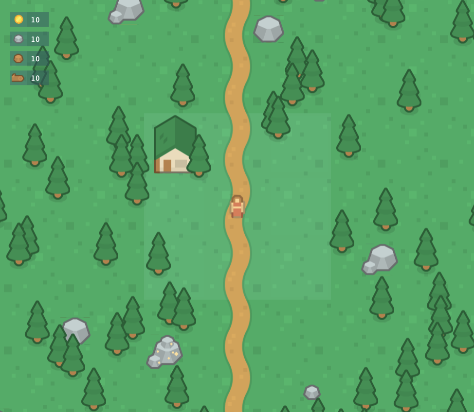

# Vilaland
A strategy boardgame that runs on your browser

# Starting
- Install node and run the following commands
- `npm install`
- `npm start`

# Roadmap
- [X] Player movement based on street click points
- [X] Set the interactive area to enable pointer cursor
- [X] Generate Random generator
- [ ] Allow players to collect resources
- [ ] Allow players to create buildings
- [ ] Allow players to create new streets and forks
- [ ] Allow NPC's to interact with buildings
- [ ] Set the player's turn and the board turn
- [ ] Enable online tables
- [ ] Screen to set the game and start a online or local table
- [ ] Screen to show the players ranking: the richest to poorest

# Creator
jonathan.nasc@live.com

# Assets
https://kenney.nl